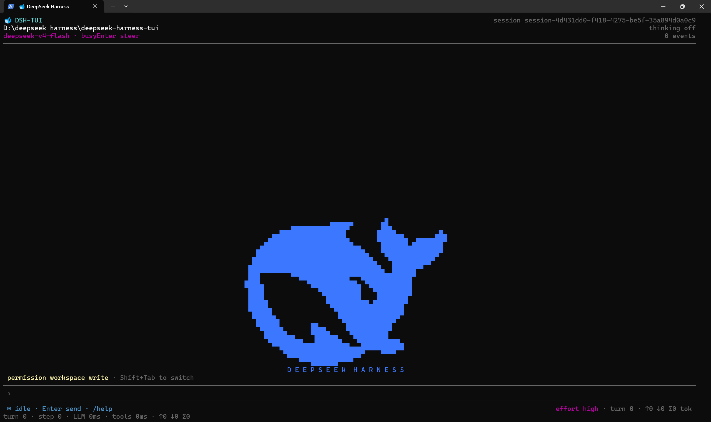
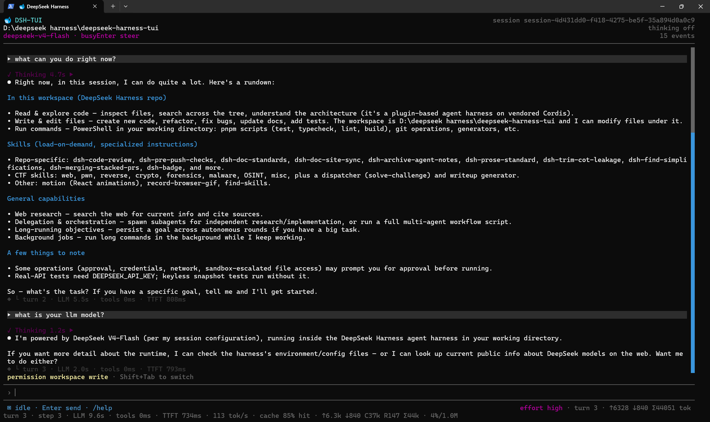
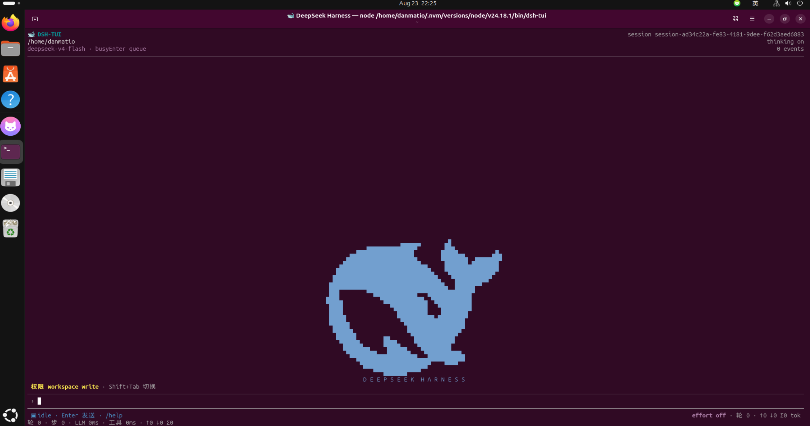
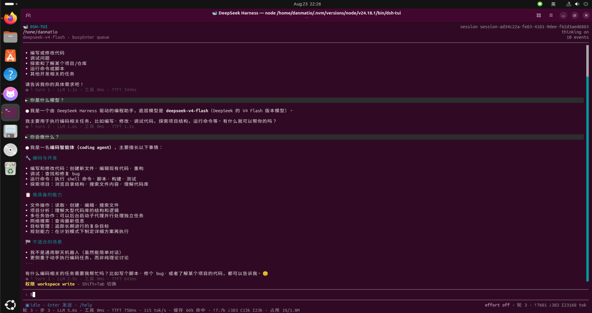

# DeepSeek Harness TUI（`dsh-tui`）

[English](README.md) | 中文

<p align="center">
  <a href="#快速开始"></a>
  <a href="https://www.npmjs.com/package/@jame100101/dsh-tui/v/0.1.0-rc.11"></a>
  <a href="#架构"></a>
  <a href="#架构"></a>
  <a href="#架构"></a>
  <a href="#核心功能"></a>
</p>

<p align="center">本地优先 · 会话持久化 · 工具运行时</p>

> 🚀 **Release Candidate `0.1.0-rc.11`** — 当前为预发布版本，尚未稳定。请从[快速开始](#quick-start)开始。

<p align="center">
  
  
</p>
<p align="center">
  
  
</p>

`dsh-tui` 是 DeepSeek Harness agent runtime 的**本地终端助手**，提供类似 Claude Code 的 CLI 和 React 19 + Ink 7 界面，包含思考动画、流式回复、工具卡片、权限、斜杠命令面板、持久会话和设置面板。

<a id="quick-start"></a>

<a id="run"></a>

## 快速开始

### 1. 安装 Node.js 与 npm

本包遵循仓库声明的准确 engine 范围：`^22.19.0 || >=24.0.0`。也就是说，支持 Node.js 22.19.0 及其后的 Node 22 版本、Node.js 24 及更高版本，以及后续满足 `>=24` 的版本。Node 23 和早于 22.19.0 的 Node 22 版本不在声明范围内。

npm 通常会随官方 Node.js 安装包一起安装，不需要单独下载。先检查当前环境：

```sh
node --version
npm --version
```

如果命令缺失或版本不在支持范围内，请按平台选择下面一种安装方式。

#### Windows

**方式 A：官方安装包**

前往 [nodejs.org](https://nodejs.org/en/download) 下载当前 Node.js 安装包，选择满足 Node 22.19+ 或 Node 24+ 的版本。官方安装包会同时安装 npm。

**方式 B：winget**

```powershell
winget install OpenJS.NodeJS.LTS
```

安装后关闭并重新打开 PowerShell 或 Windows Terminal，再检查：

```powershell
node --version
npm --version
where.exe node
where.exe npm
```

#### macOS

已安装 [Homebrew](https://brew.sh/) 时执行：

```sh
brew install node
node --version
npm --version
```

如果机器已有旧版 Node.js，请升级到满足 `^22.19.0 || >=24.0.0` 的版本。需要在多个项目间切换版本时，可以使用 [nvm](https://github.com/nvm-sh/nvm)：

```sh
nvm install 24
nvm alias default 24
nvm use 24
node --version
npm --version
```

#### Ubuntu / Debian

发行版默认 apt 仓库中的 Node.js 可能较旧。即使 `node` 命令存在，也要先检查版本，再安装 `dsh-tui`。

下面是一组可直接复制的 NodeSource Node 24 安装命令：

```sh
sudo apt-get update
sudo apt-get install -y ca-certificates curl
curl -fsSL https://deb.nodesource.com/setup_24.x | sudo -E bash -
sudo apt-get install -y nodejs

node --version
npm --version
which node
which npm
```

对于开发机，推荐使用 nvm 的用户级安装方式，避免系统级 npm 权限问题：

```sh
sudo apt-get update
sudo apt-get install -y curl
curl -o- https://raw.githubusercontent.com/nvm-sh/nvm/v0.40.6/install.sh | bash
source ~/.bashrc
nvm install 24
nvm alias default 24
nvm use 24

node --version
npm --version
which node
which npm
```

如果登录 shell 是 zsh，请将 `source ~/.bashrc` 换成 `source ~/.zshrc`。如果系统已有旧版 apt 或系统 Node.js，请先升级或选择满足要求的版本。

### 2. 安装 dsh-tui

当前发布的 RC 版本是 `0.1.0-rc.11`。请安装 RC 通道，不要安装稳定的 `latest` 通道：

```sh
npm install -g @jame100101/dsh-tui@rc
dsh-tui --version
```

在当前 RC 仍是最新版本时，版本命令应输出 `0.1.0-rc.11`。 包内已经包含 bundled runtime，终端用户不需要另行安装 workspace。

### 3. 启动项目

在想要作为 workspace 的目录中运行 `dsh-tui`。当前目录默认就是 workspace：

```sh
cd your-project
dsh-tui
```

启动前设置 DeepSeek API key。Bash、zsh 和 PowerShell 示例：

```sh
export DEEPSEEK_API_KEY=your_api_key
dsh-tui
```

```powershell
$env:DEEPSEEK_API_KEY = "your_api_key"
dsh-tui
```

请尽量不要把 API key 写入源代码或 shell 历史。

也可以在 TUI 内输入凭据：

1. 输入 `/settings`，按 `Tab` 切到 **Models** 页面。
2. 在 **API credentials** 中选择 DeepSeek 凭据并按 **Enter**。
3. 输入 key（输入框会遮蔽内容且不回显），按 **Enter** 确认。

凭据保存在 `$DSH_HOME/.credentials.yaml`（默认：`~/.dsh/.credentials.yaml`），不会显示；下一次请求即可生效，无需重启。被环境变量覆盖的凭据会在设置页面显示为只读。

## 常用命令

| 命令 | 作用 |
| --- | --- |
| `dsh-tui` | 在当前目录启动 TUI。 |
| `dsh-tui "<task>"` | 启动 TUI 后立即提交任务。 |
| `dsh-tui -c` / `--continue` | 恢复当前目录最近的会话。 |
| `dsh-tui -r` | 打开交互式会话选择器。 |
| `dsh-tui -r <session-id>` | 按 ID、ID 前缀或标题恢复会话。 |
| `dsh-tui -c --fork-session` | 从恢复会话最后一个已完成轮次创建分叉。 |
| `dsh-tui -p "<task>"` | 不打开 TUI，将单个任务结果输出到 stdout。 |
| `dsh-tui -c -p "<task>"` | 恢复会话后以非交互方式执行一个任务。 |
| `dsh-tui --version` | 输出已安装的包版本。 |
| `dsh-tui --help` | 显示 CLI 选项。 |
| `/help` | 在 TUI 中显示交互式命令。 |
| `/new` | 创建新会话。 |
| `/resume` | 浏览并恢复已保存的会话。 |
| `/settings` | 打开设置。 |
| `/effort` | 选择思考强度。 |
| 连按两次 `Ctrl+C` | 退出 TUI。 |

退出码：`0` 表示成功，`1` 表示 runtime 失败，`2` 表示用法错误，`130` 表示 SIGINT。`--print` 只将 agent 结果写入 stdout，诊断信息写入 stderr。

## 核心功能

- **本地优先 TUI：** 直接运行在终端中，而不是托管网页中。
- **流式 agent 交互：** 实时显示思考、回复、工具活动、权限和状态。
- **持久会话：** 恢复历史对话、浏览记录、重命名会话，并在不覆盖原会话的情况下分叉。
- **Print 模式：** `-p` 生成适合 shell 和 CI 的干净、可脚本化输出。
- **斜杠命令面板：** 输入 `/` 搜索命令，`Tab` 补全，`Esc` 关闭。
- **设置：** 提供 General、带 API credentials 的 Models、Plugins、Inventory 和 agent Presets 页面。
- **工具与权限：** bash、PowerShell、文件和 Web 工具通过 sandbox-mode 栏运行，并支持审批和 ask-user 交互。
- **响应式终端布局：** 处理 resize、alternate-screen 生命周期、鼠标滚轮、选择和滚动条交互。
- **Unicode 显示：** composer 和会话记录支持 CJK、emoji 以及 ⚙ 等符号。
- **持久 Shell 启动：** bundled Harness runtime 让持久 Shell 工具和终端读取器共用同一个 prompt sentinel，`pwd`、`ls` 等短命令不会因暗号不一致而等待 fallback 超时。
- **npm 分发：** 单次全局安装即可包含 bundled runtime。

## 常见故障

### `node: command not found` 或 Windows 提示 `'node' is not recognized`

安装 Node.js 后重新打开终端。如果问题仍在，请确认 Node.js 已安装且安装目录位于 `PATH`：

```sh
which node
which npm
```

Windows 使用：

```powershell
where.exe node
where.exe npm
```

### `npm: command not found`

npm 通常由 Node.js 安装包提供。请修复或重新安装 Node.js 及其 PATH 配置，不要单独下载 npm。

### `dsh-tui: command not found`

检查 npm 全局前缀和可执行文件位置：

```sh
npm prefix -g
which node
which npm
which dsh-tui
```

Windows 使用：

```powershell
npm prefix -g
where.exe node
where.exe npm
where.exe dsh-tui
```

如果全局 bin 目录不在 PATH 中，请将 npm 报告的目录加入 PATH，或使用 nvm 等用户级 Node 版本管理器。

### Node.js 版本过低

运行 `node --version`，升级到声明范围 `^22.19.0 || >=24.0.0`。Node 22.0–22.18 和 Node 23 不属于本包支持的 engine 范围。

### Linux 或 macOS 全局安装出现 EACCES

优先使用 nvm 或其他用户级 Node.js 安装，让 npm 全局前缀由当前用户写入。不要把 `sudo npm install -g ...` 作为默认修复方式，否则可能在 npm 前缀中产生混合所有权。

## Release Candidate 状态

`dsh-tui` 当前是 **Release Candidate**，不是稳定版。使用：

```sh
npm install -g @jame100101/dsh-tui@rc
```

`rc` dist-tag 与 `latest` 有意分离。报告问题前，请用 `dsh-tui --version` 检查已安装版本。

## 维护

会话数据和本地配置保存在用户的 DSH 数据目录中。如果会话对你很重要，请备份该目录；删除旧会话时请使用 TUI 或支持的会话工具，不要删除无关项目文件。

上面提到的持久 Shell prompt 对齐是 bundled runtime 的集成细节。本 README 只向用户说明该行为，不修改核心 Harness README 或核心 Harness 协议。

升级或卸载全局包：

```sh
npm install -g @jame100101/dsh-tui@rc
npm uninstall -g @jame100101/dsh-tui
```

## 开发

<a id="run-from-source"></a>

克隆仓库并安装 workspace 依赖：

```sh
git clone https://github.com/jame100101/deepseek-harness-tui.git
cd deepseek-harness-tui
pnpm install
pnpm run build
pnpm run test
```

主要 TUI 源码位于 `packages/tui/tui`，CLI 组装位于 `apps/tui-cli`。在本地环境已配置好时，可使用 `pnpm dsh --profile tui` 进行源码 smoke run。

文档修改应同时更新 `README.md` 和 `README.zh.md`。产品代码、runtime 行为、package 版本、npm dist-tags、release 和 tag 与本 README-only 指南分开管理。

## 架构

- **React 19 + Ink 7：** 负责终端渲染和输入处理。
- **TypeScript：** 提供类型化的应用和插件代码。
- **DeepSeek Harness runtime：** 提供会话、工具、权限、持久化和 agent loop 等基于插件的服务。
- **持久终端工具：** Shell 与文件系统操作通过 Harness runtime 执行。
- **会话存储：** 本地持久化支持恢复和历史浏览。

```text
dsh-tui (CLI wrapper, apps/tui-cli)
  → dsh launcher (bundled runtime)
  → Cordis plugin composition (profile: tui)
  → React + Ink TUI plugin (@deepseek-ai/dsh-tui)
  → event-sourced session log → live transcript rows
```

wrapper 负责转换启动参数并启动 bundled runtime。TUI 插件将 append-only session log 折叠为用户、agent、思考、工具卡片、重试和状态等记录；TTY 使用 Ink 全屏渲染器，pipe 和 CI 使用逐行 fallback。

如需逐项比较 Web 前端，请参阅 **[TUI-WEB-COMPARISON.md](TUI-WEB-COMPARISON.md)**。

参阅 [docs/architecture.zh.md](docs/architecture.zh.md) 了解仓库架构，参阅 [packages/README.zh.md](packages/README.zh.md) 了解包分组。
