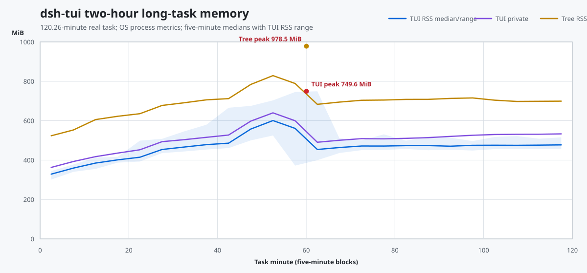
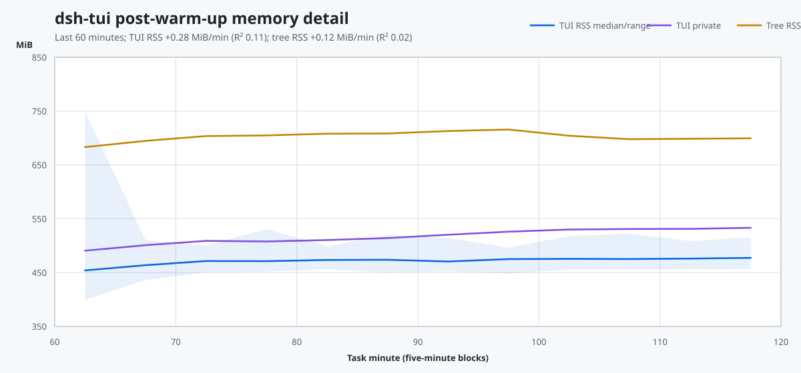

# dsh-tui 长任务稳定性审计

本报告合并 `v0.1.0-rc.12` 的代码审计、聚焦测试证据、30 分钟自动 ConPTY campaign 和 2026-08-30 的两小时真实任务监控。当前性能数值以 [`../performance/DSH_TUI_PERF_CURRENT.md`](../performance/DSH_TUI_PERF_CURRENT.md) 为准；本页负责解释实现覆盖、剩余风险和 Issue #31 的关闭判断。

## 审计结论

四类约 4 GiB OOM 根因已有代码级硬上限或 latest-wins 语义：Ink 输入 parser pending、stdout 背压帧、composer 乐观状态数量和 React development User Timing measures。两小时真实任务没有发生进程退出、PID 变化、采样中断、约 4 GiB 内存增长或外部可观察的输入/滚动/动画停顿。

外置监控的完整进程树 RSS 峰值为 978.46 MiB，TUI RSS 峰值为 749.59 MiB；后 60 分钟的完整进程树 RSS 斜率为 +0.118 MiB/min（R² 0.02），TUI RSS 斜率为 +0.279 MiB/min（R² 0.11）。这组数据支持关闭 Issue #31 的崩溃主问题，并把未界定容器与更完整的性能诊断拆为后续工作。

## 证据身份

| 项 | 值 |
|---|---|
| 仓库 | `D:\deepseek harness\deepseek-harness-tui` |
| 分支 / HEAD / tag | `main` / `a1d8ee0` / `v0.1.0-rc.12` |
| 两小时任务 | 2026-08-30 09:34:00–11:34:15（UTC+08:00），120.26 min |
| 外置监控 | 1495 个总样本，任务窗口 1383 个样本，5.1–5.4 s 间隔 |
| 连续性 | launcher PID `15216`、TUI PID `13856` 全程不变；0 个缺失样本 |
| 派生数据 | [`long-task-2h-20260830-summary.json`](./long-task-2h-20260830-summary.json) |
| 自动 campaign | [`conpty-soak-last.json`](./conpty-soak-last.json)，30 min |
| 累计投影 soak | [`soak-last.json`](./soak-last.json) |

任务运行期间另一个会话修改了工作树。TUI 进程没有热重载，监控数据对应任务启动时已加载的 `v0.1.0-rc.12` 运行时；最终 dirty tree 不能作为该进程的精确源快照。两小时任务自身保持只读，没有产生仓库文件。

## 崩溃根因闭合情况

| 原因 | 当前机制 | 容量语义 | 主要验证 |
|---|---|---|---|
| 不完整 paste/CSI 长期累积 | Ink parser 对 paste 设 1 MiB 上限，对 CSI 设 64 字符上限，并在 2 s 闲置后 abort | O(1 MiB)；discard 状态不保存正文 | parser 分片、超限、结束标记和复位测试 |
| stdout 背压期间积累完整帧 | 背压只记录一个 pending redraw 标志，`drain` 后从最新 React 树重绘 | O(1) 待绘状态，加 Node 当前写缓冲 | `ink-output-arbiter.spec.ts` latest-wins 测试 |
| 每键乐观草稿集合保留旧字符串 | 单一 `localValue`、`latestValueRef` 和 `draftSeq` 收敛，不按键累积 Set | 状态份数 O(1)；草稿长度另行处理 | composer/render-frame 输入测试 |
| React 开发测量条目长期保留 | launcher 在依赖图加载前设置 production React | 不产生 development measure 序列 | 相同 3000 节点、25 Hz 的前后 ConPTY 对比 |

投影另有 3000 节点、1.5M 计入预算字符、512 trace、32 KiB assistant、8 KiB user 和 4 KiB thinking/tool/context 上限；live 内容饱和后保持引用并跳过无变化 publish。launcher 在正常退出、失败和 fatal 兜底路径恢复鼠标、paste、光标、alt-screen 和 SGR 状态。

## 两小时运行结果

| 指标 | 结果 |
|---|---:|
| TUI RSS，开始 / 结束 / 峰值 | 300.96 / 487.90 / 749.59 MiB |
| TUI Private Bytes，开始 / 结束 / 峰值 | 333.05 / 544.50 / 790.08 MiB |
| 进程树 RSS，开始 / 结束 / 峰值 | 491.13 / 710.43 / 978.46 MiB |
| 后 60 分钟 TUI RSS，中位数 / P95 / 最大值 | 472.34 / 496.59 / 530.71 MiB |
| 后 60 分钟 TUI RSS 斜率 / R² | +0.279 MiB/min / 0.11 |
| 后 60 分钟进程树 RSS 斜率 / R² | +0.118 MiB/min / 0.02 |
| 后 30 分钟 TUI RSS 净变化 | +4.33 MiB |
| TUI / 进程树单核平均 CPU | 15.22% / 15.99% |
| 句柄，开始 / 结束 / 峰值 | 1523 / 1954 / 2090 |
| 线程，开始 / 结束 / 峰值 | 72 / 56 / 75 |

第 60 分钟附近存在一次明显回收：TUI RSS 从 749.59 MiB 降到 399.40 MiB。后半程五分钟块的 TUI RSS 中位数从约 454 MiB 缓慢变化到约 477 MiB，进程树中位数保持约 683–716 MiB。Private Bytes 后 60 分钟仍有 +0.740 MiB/min、R² 0.45 的弱增长，应通过 V8 heap 和容器计数继续归因，不能把 RSS 平台直接解释成所有 JS retainers 均已饱和。

## 交互和渲染证据

自动 30 分钟 Windows ConPTY campaign 包含 40 次真实构建、7392 次输入确认和持续 busy 渲染：输入 p50/p95/p99/max 为 62/94/111/296 ms，Thinking 最大停顿 560 ms，构建失败 0。真实两小时任务中，执行者报告输入、历史滚动、Shift+Tab、Thinking 秒数和动画、todo/goal 更新均未复现卡死；该部分是人工观察，因为外置 CSV 没有输入确认、帧率或 stall 字段。

流式 token 以 40 ms 合帧，结构事件立即发布；live assistant 只重算未完成末行，Thinking 只投影有界尾部。Thinking 动画和秒数保留在局部子树，滚轮使用微任务合批和缓存高度索引，stdout 背压不会排队历史帧。

## 输入、权限和会话结论

- Shift+Tab 只接受 Kitty press；repeat/release 和同批尾部不会重复旋转权限。权限变化同步写入 session log，提交或回答不会用旧本地状态覆盖它。
- CJK/emoji 宽度、caret 和 delayed bracketed paste 有组件及 parser 测试；缺少真实 IME composition 事件流自动测试。
- `dsh-tui -c` 以 `lastUsedAt → createdAt → id` 选择最近使用 session，排除 subagent，sidecar 有 1000 条上限并通过文件锁合并跨进程写入。
- session 切换仍需要清理或隔离 question resolver、feedback 异步返回、附件异步返回、workflow/subagent 面板状态。

## 剩余有界性问题

### 优先处理

1. `historyRef` 增加条数和总字节上限，并在 `/new`、resume 和 session swap 时重置。
2. `pastedTextBlocksRef` 增加聚合字节上限；composer 编辑期增加长度约束，避免只在 submit 时拒绝 900 KiB 以上文本。
3. clipboard/image 子进程增加超时、stdout 字节上限、stdin/stdout error 处理；图片在完整 `readFileSync` 前执行大小检查。
4. session swap 落定 question/approval resolver，并为 feedback、attachment 和 catalog 异步结果增加 generation 守卫。
5. `surface.workflows` 和 subagent 面板状态按会话重置或只保留最近 N 条。

### 后续测量与正确性

1. fold 字符预算纳入 `callCard`/`resultCard`，并清理 `NodeLineCache.counts` 的旧宽度变体。
2. CSI parser 以终止字节识别带参数序列，覆盖 `[1;5B`、`[3;5~` 等分片尾。
3. sidecar 超限写入通过 `reportError` 可观察，prune 避免一次解析全部 64 个接近 4 MiB 的文件。
4. OSC52 对超大文本分块或明确报告终端拒绝，而不是把一次 `write` 当成复制成功。
5. 增加 V8 heap spaces、`external`、`stdout.writableLength`、frame drop、input-to-flush、composer/history/paste/workflow 大小采样。

这些项目可能影响极长会话、极大草稿、clipboard helper 或 session swap，但不是本次已验证的 4 GiB 快速 OOM 根因。

## Issue #31 关闭判断

Issue #31 的崩溃主问题满足关闭条件：两小时真实任务、固定 PID、无缺失样本、低于 1 GiB 的进程树峰值、大幅回收和后半程低斜率平台均已取得证据。关闭说明应链接本报告、当前性能基线和派生 JSON，并把“剩余有界性问题”迁移到独立 issue。

如果 Issue #31 的验收文本要求 V8 heap spaces、composer 字节数和真实 `writableLength` 曲线全部存在，则这些诊断字段仍未覆盖；应调整为独立 observability 工作，而不是继续把已消失的崩溃故障保持开放。

## Harness 影响范围

TUI 通过 session projection 和内部 dispatch 消费 Harness 状态。长任务稳定性修改集中在 `packages/tui`、`apps/tui-cli`、Ink patch 和 `evaluation/tui`；`agent-loop`、模型 provider、联网搜索、工具执行和持久化 session 格式没有因本轮性能修复而改变。
